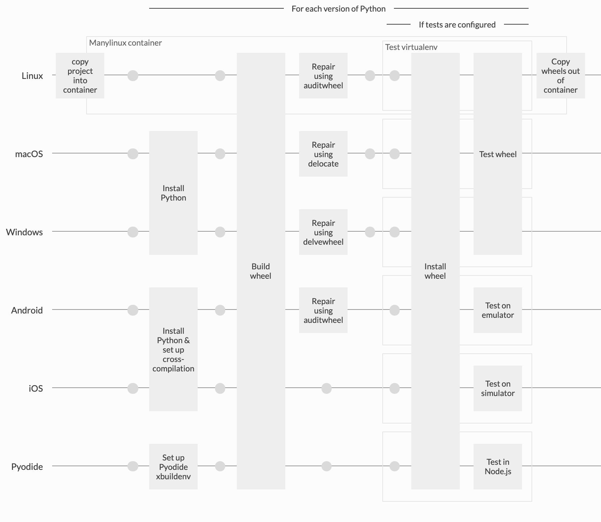

cibuildwheel
============

[](https://pypi.python.org/pypi/cibuildwheel)
[](https://cibuildwheel.pypa.io/en/stable/?badge=stable)
[](https://github.com/pypa/cibuildwheel/actions)
[](https://circleci.com/gh/pypa/cibuildwheel)
[](https://dev.azure.com/joerick0429/cibuildwheel/_build/latest?definitionId=4&branchName=main)


[Documentation](https://cibuildwheel.pypa.io)

<!--intro-start-->

Python wheels are great. Building them across **Mac, Linux, Windows**, on **multiple versions of Python**, is not.

`cibuildwheel` is here to help. `cibuildwheel` runs on your CI server - currently it supports GitHub Actions, Azure Pipelines, CircleCI, and GitLab CI - and it builds and tests your wheels across all of your platforms.


What does it do?
----------------

While cibuildwheel itself requires a recent Python version to run (we support the last three releases), it can target the following versions to build wheels:

|                          | macOS Intel | macOS Apple Silicon | Windows 64bit | Windows 32bit | Windows Arm64  | manylinux<br/>musllinux x86_64 | manylinux<br/>musllinux i686 | manylinux<br/>musllinux aarch64 | manylinux<br/>musllinux ppc64le | manylinux<br/>musllinux s390x | manylinux<br/>musllinux armv7l | Android | iOS | Pyodide        |
| ------------------------ | ----------- | ------------------- | ------------- | ------------- | -------------- | ------------------------------ | ---------------------------- | ------------------------------- | ------------------------------- | ----------------------------- | ------------------------------ | ------- | --- | -------------- |
| CPython 3.9              | ✅          | ✅                  | ✅            | ✅            | ✅<sup>2</sup> | ✅                             | ✅                           | ✅                              | ✅                              | ✅                            | ✅<sup>4</sup>                 | N/A     | N/A | N/A            |
| CPython 3.10             | ✅          | ✅                  | ✅            | ✅            | ✅<sup>2</sup> | ✅                             | ✅                           | ✅                              | ✅                              | ✅                            | ✅<sup>4</sup>                 | N/A     | N/A | N/A            |
| CPython 3.11             | ✅          | ✅                  | ✅            | ✅            | ✅<sup>2</sup> | ✅                             | ✅                           | ✅                              | ✅                              | ✅                            | ✅<sup>4</sup>                 | N/A     | N/A | N/A            |
| CPython 3.12             | ✅          | ✅                  | ✅            | ✅            | ✅<sup>2</sup> | ✅                             | ✅                           | ✅                              | ✅                              | ✅                            | ✅<sup>4</sup>                 | N/A     | N/A | ✅<sup>3</sup> |
| CPython 3.13             | ✅          | ✅                  | ✅            | ✅            | ✅<sup>2</sup> | ✅                             | ✅                           | ✅                              | ✅                              | ✅                            | ✅<sup>4</sup>                 | ✅      | ✅  | ✅             |
| CPython 3.14             | ✅          | ✅                  | ✅            | ✅            | ✅<sup>2</sup> | ✅                             | ✅                           | ✅                              | ✅                              | ✅                            | ✅<sup>4</sup>                 | ✅      | ✅  | ✅             |
| CPython 3.15<sup>5</sup> | ✅          | ✅                  | ✅            | ✅            | ✅<sup>2</sup> | ✅                             | ✅                           | ✅                              | ✅                              | ✅                            | ✅<sup>4</sup>                 | ✅      | ✅  | N/A            |
| PyPy 3.9 v7.3            | ✅          | ✅                  | ✅            | N/A           | N/A            | ✅<sup>1</sup>                 | ✅<sup>1</sup>               | ✅<sup>1</sup>                  | N/A                             | N/A                           | N/A                            | N/A     | N/A | N/A            |
| PyPy 3.10 v7.3           | ✅          | ✅                  | ✅            | N/A           | N/A            | ✅<sup>1</sup>                 | ✅<sup>1</sup>               | ✅<sup>1</sup>                  | N/A                             | N/A                           | N/A                            | N/A     | N/A | N/A            |
| PyPy 3.11 v7.3           | ✅          | ✅                  | ✅            | N/A           | N/A            | ✅<sup>1</sup>                 | ✅<sup>1</sup>               | ✅<sup>1</sup>                  | N/A                             | N/A                           | N/A                            | N/A     | N/A | N/A            |
| GraalPy 3.12 v25.0       | ✅          | ✅                  | ✅            | N/A           | N/A            | ✅<sup>1</sup>                 | N/A                          | ✅<sup>1</sup>                  | N/A                             | N/A                           | N/A                            | N/A     | N/A | N/A            |

<sup>**1** PyPy & GraalPy are only supported for manylinux wheels.</sup><br>
<sup>**2** Windows arm64 support is experimental.</sup><br>
<sup>**3** Not supported on PyPI, uses old `pyodide` tag instead of `pyemscripten`. Requires `pyodide-eol` [`enable`](https://cibuildwheel.pypa.io/en/stable/options/#enable).</sup><br>
<sup>**4** manylinux armv7l support is experimental. As there are no RHEL based image for this architecture, it's using an Ubuntu based image instead.</sup><br>
<sup>**5** Python 3.15 requires opt-in using [`enable`](https://cibuildwheel.pypa.io/en/stable/options/#enable).</sup><br>

- Builds manylinux, musllinux, macOS, Windows, pyemscripten, iOS, and Android wheels
- Supports CPython, PyPy, and GraalPy
- Works on GitHub Actions, Azure Pipelines, CircleCI, and GitLab CI
- Bundles shared library dependencies on Linux through [auditwheel](https://github.com/pypa/auditwheel), macOS through [delocate](https://github.com/matthew-brett/delocate), and Windows through [delvewheel](https://github.com/adang1345/delvewheel)
- Runs your library's tests against the wheel-installed version of your library

See the [cibuildwheel 1 documentation](https://cibuildwheel.pypa.io/en/1.x/) if you need to build unsupported versions of Python, such as Python 2.

Usage
-----

`cibuildwheel` runs inside a CI service. Supported platforms depend on which service you're using:

|                 | Linux | macOS | Windows | Linux ARM      | macOS ARM | Windows ARM    | Android                    | iOS                        | Pyodide        |
| --------------- | ----- | ----- | ------- | -------------- | --------- | -------------- | -------------------------- | -------------------------- | -------------- |
| GitHub Actions  | ✅    | ✅    | ✅      | ✅             | ✅        | ✅<sup>2</sup> | ✅<sup>4</sup>             | ✅<sup>3</sup>             | ✅             |
| Azure Pipelines | ✅    | ✅    | ✅      |                | ✅        | ✅<sup>2</sup> | ✅<sup>4</sup>             | ✅<sup>3</sup>             | ✅<sup>5</sup> |
| CircleCI        | ✅    | ✅    |         | ✅             | ✅        |                | ✅<sup>4</sup><sup>5</sup> | ✅<sup>3</sup><sup>5</sup> | ✅<sup>5</sup> |
| GitLab CI       | ✅    | ✅    | ✅      | ✅<sup>1</sup> | ✅        |                | ✅<sup>4</sup><sup>5</sup> | ✅<sup>3</sup><sup>5</sup> | ✅<sup>5</sup> |

<sup>**1** [Requires emulation](https://cibuildwheel.pypa.io/en/stable/faq/#emulation), distributed separately. Other services may also support Linux ARM through emulation or third-party build hosts, but these are not tested in our CI.</sup><br>
<sup>**2** [Uses cross-compilation](https://cibuildwheel.pypa.io/en/stable/faq/#windows-arm64). It is not possible to test `arm64` on this CI platform.</sup><br>
<sup>**3** Requires a macOS runner; runs tests on the simulator for the runner's architecture. </sup><br>
<sup>**4** Building for Android requires the runner to be Linux x86_64, macOS ARM64 or macOS x86_64. Testing has [additional requirements](https://cibuildwheel.pypa.io/en/stable/platforms/#android).</sup><br>
<sup>**5** Builds may work, but are untested in cibuildwheel's CI.</sup><br>

<!--intro-end-->

Example setup
-------------

To build manylinux, musllinux, macOS, and Windows wheels on GitHub Actions, you could use this `.github/workflows/wheels.yml`:

<!--generic-github-start-->
```yaml
name: Build

on: [push, pull_request]

jobs:
  build_wheels:
    name: Build wheels on ${{ matrix.os }}
    runs-on: ${{ matrix.os }}
    strategy:
      matrix:
        os: [ubuntu-latest, ubuntu-24.04-arm, windows-latest, windows-11-arm, macos-15-intel, macos-latest]

    steps:
      - uses: actions/checkout@v6
        with:
          persist-credentials: false

      # Used to host cibuildwheel
      - uses: actions/setup-python@v6

      - name: Install cibuildwheel
        run: python -m pip install cibuildwheel==4.1.0

      - name: Build wheels
        run: python -m cibuildwheel --output-dir wheelhouse
        # to supply options, put them in 'env', like:
        # env:
        #   CIBW_SOME_OPTION: value
        #   ...

      - uses: actions/upload-artifact@v6
        with:
          name: cibw-wheels-${{ matrix.os }}-${{ strategy.job-index }}
          path: ./wheelhouse/*.whl
```
<!--generic-github-end-->

For more information, including PyPI deployment, and the use of other CI services or the dedicated GitHub Action, check out the [documentation](https://cibuildwheel.pypa.io) and the [examples](https://github.com/pypa/cibuildwheel/tree/main/examples).

How it works
------------

The following diagram summarises the steps that cibuildwheel takes on each platform.



<sup>Explore an interactive version of this diagram [in the docs](https://cibuildwheel.pypa.io/en/stable/#how-it-works).</sup>

> [!WARNING]
> Building and testing wheels executes arbitrary code from your project and its dependencies. Although cibuildwheel uses OCI containers and Pyodide for some builds, these provide no security guarantees - the code you're building and testing has full access to the environment that's invoking cibuildwheel.
>
> If you cannot trust all the code that's pulled in, maintain good security hygiene: keep the job that builds distributions separate from the job that uploads them to PyPI, handle secrets and credentials with care and rotate them regularly, and follow the principle of least privilege when granting permissions. Do not store sensitive data on CI runners.


<!--[[[cog from readme_options_table import get_table; print(get_table()) ]]]-->

<!-- This table is auto-generated from docs/options.md by bin/readme_options_table.py -->

|   | Option | Description |
|---|---|---|
| **Build selection** | [`platform`](https://cibuildwheel.pypa.io/en/stable/options/#platform) | Override the auto-detected target platform |
|  | [`build`<br>`skip`](https://cibuildwheel.pypa.io/en/stable/options/#build-skip) | Choose the Python versions to build |
|  | [`archs`](https://cibuildwheel.pypa.io/en/stable/options/#archs) | Change the architectures built on your machine by default. |
|  | [`project-requires-python`](https://cibuildwheel.pypa.io/en/stable/options/#requires-python) | Manually set the Python compatibility of your project |
|  | [`enable`](https://cibuildwheel.pypa.io/en/stable/options/#enable) | Enable building with extra categories of selectors present. |
|  | [`allow-empty`](https://cibuildwheel.pypa.io/en/stable/options/#allow-empty) | Suppress the error code if no wheels match the specified build identifiers |
| **Build customization** | [`build-frontend`](https://cibuildwheel.pypa.io/en/stable/options/#build-frontend) | Set the tool to use to build, either "build" (default), "build\[uv\]", or "pip" |
|  | [`config-settings`](https://cibuildwheel.pypa.io/en/stable/options/#config-settings) | Specify config-settings for the build backend. |
|  | [`environment`](https://cibuildwheel.pypa.io/en/stable/options/#environment) | Set environment variables |
|  | [`environment-pass`](https://cibuildwheel.pypa.io/en/stable/options/#environment-pass) | Set environment variables on the host to pass-through to the container. |
|  | [`before-all`](https://cibuildwheel.pypa.io/en/stable/options/#before-all) | Execute a shell command on the build system before any wheels are built. |
|  | [`before-build`](https://cibuildwheel.pypa.io/en/stable/options/#before-build) | Execute a shell command preparing each wheel's build |
|  | [`xbuild-tools`](https://cibuildwheel.pypa.io/en/stable/options/#xbuild-tools) | Binaries on the path that should be included in an isolated cross-build environment. |
|  | [`xbuild-files`](https://cibuildwheel.pypa.io/en/stable/options/#xbuild-files) | Platform-specific files in the build environment |
|  | [`repair-wheel-command`](https://cibuildwheel.pypa.io/en/stable/options/#repair-wheel-command) | Execute a shell command to repair each built wheel |
|  | [`manylinux-*-image`<br>`musllinux-*-image`](https://cibuildwheel.pypa.io/en/stable/options/#linux-image) | Specify manylinux / musllinux container images |
|  | [`container-engine`](https://cibuildwheel.pypa.io/en/stable/options/#container-engine) | Specify the container engine to use when building Linux wheels |
|  | [`dependency-versions`](https://cibuildwheel.pypa.io/en/stable/options/#dependency-versions) | Control the versions of the tools cibuildwheel uses |
|  | [`pyodide-version`](https://cibuildwheel.pypa.io/en/stable/options/#pyodide-version) | Specify the Pyodide version to use for `pyodide` platform builds |
| **Auditing** | [`audit-requires`](https://cibuildwheel.pypa.io/en/stable/options/#audit-requires) | Install Python dependencies for the audit step |
|  | [`audit-command`](https://cibuildwheel.pypa.io/en/stable/options/#audit-command) | Use a tool to check wheels before the end of the run |
| **Testing** | [`test-command`](https://cibuildwheel.pypa.io/en/stable/options/#test-command) | The command to test each built wheel |
|  | [`before-test`](https://cibuildwheel.pypa.io/en/stable/options/#before-test) | Execute a shell command before testing each wheel |
|  | [`test-sources`](https://cibuildwheel.pypa.io/en/stable/options/#test-sources) | Paths that are copied into the working directory of the tests |
|  | [`test-requires`](https://cibuildwheel.pypa.io/en/stable/options/#test-requires) | Install Python dependencies before running the tests |
|  | [`test-extras`](https://cibuildwheel.pypa.io/en/stable/options/#test-extras) | Install your wheel for testing using `extras_require` |
|  | [`test-groups`](https://cibuildwheel.pypa.io/en/stable/options/#test-groups) | Specify test dependencies from your project's `dependency-groups` |
|  | [`test-skip`](https://cibuildwheel.pypa.io/en/stable/options/#test-skip) | Skip running tests on some builds |
|  | [`test-environment`](https://cibuildwheel.pypa.io/en/stable/options/#test-environment) | Set environment variables for the test environment |
|  | [`test-runtime`](https://cibuildwheel.pypa.io/en/stable/options/#test-runtime) | Controls how the tests will be executed. |
| **Debugging** | [`debug-keep-container`](https://cibuildwheel.pypa.io/en/stable/options/#debug-keep-container) | Keep the container after running for debugging. |
|  | [`debug-traceback`](https://cibuildwheel.pypa.io/en/stable/options/#debug-traceback) | Print full traceback when errors occur. |
|  | [`build-verbosity`](https://cibuildwheel.pypa.io/en/stable/options/#build-verbosity) | Increase/decrease the output of the build |


<!--[[[end]]] (sum: Of/28Z7Nut) -->

These options can be specified in a pyproject.toml file, or as environment variables, see [configuration docs](https://cibuildwheel.pypa.io/en/latest/configuration/).

Working examples
----------------

Here are some repos that use cibuildwheel.

<!-- START bin/projects.py -->

<!-- this section is generated by bin/projects.py. Don't edit it directly, instead, edit docs/data/projects.yml -->

| Name                              | CI | OS | Notes |
|-----------------------------------|----|----|:------|
| [scikit-learn][]                  | ![github icon][] | ![windows icon][] ![apple icon][] ![linux icon][] ![pyodide icon][] | The machine learning library. A complex but clean config using many of cibuildwheel's features to build a large project with Cython and C++ extensions.  |
| [duckdb][]                        | ![github icon][] | ![apple icon][] ![linux icon][] ![windows icon][] | DuckDB is an analytical in-process SQL database management system |
| [NumPy][]                         | ![github icon][] ![travisci icon][] | ![windows icon][] ![apple icon][] ![linux icon][] ![pyodide icon][] | The fundamental package for scientific computing with Python. |
| [pytorch-fairseq][]               | ![github icon][] | ![apple icon][] ![linux icon][] | Facebook AI Research Sequence-to-Sequence Toolkit written in Python. |
| [NCNN][]                          | ![github icon][] | ![windows icon][] ![apple icon][] ![linux icon][] | ncnn is a high-performance neural network inference framework optimized for the mobile platform |
| [Matplotlib][]                    | ![github icon][] | ![windows icon][] ![apple icon][] ![linux icon][] ![pyodide icon][] | The venerable Matplotlib, a Python library with C++ portions |
| [Tornado][]                       | ![github icon][] | ![linux icon][] ![apple icon][] ![windows icon][] | Tornado is a Python web framework and asynchronous networking library. Uses stable ABI for a small C extension. |
| [MyPy][]                          | ![github icon][] | ![apple icon][] ![linux icon][] ![windows icon][] | The compiled version of MyPy using MyPyC. |
| [Prophet][]                       | ![github icon][] | ![windows icon][] ![apple icon][] ![linux icon][] | Tool for producing high quality forecasts for time series data that has multiple seasonality with linear or non-linear growth. |
| [Triton][]                        | ![github icon][] | ![linux icon][] | Self hosted runners |

[scikit-learn]: https://github.com/scikit-learn/scikit-learn
[duckdb]: https://github.com/duckdb/duckdb
[NumPy]: https://github.com/numpy/numpy
[pytorch-fairseq]: https://github.com/facebookresearch/fairseq
[NCNN]: https://github.com/Tencent/ncnn
[Matplotlib]: https://github.com/matplotlib/matplotlib
[Tornado]: https://github.com/tornadoweb/tornado
[MyPy]: https://github.com/mypyc/mypy_mypyc-wheels
[Prophet]: https://github.com/facebook/prophet
[Triton]: https://github.com/openai/triton

[github icon]: docs/data/readme_icons/github.svg
[azurepipelines icon]: docs/data/readme_icons/azurepipelines.svg
[circleci icon]: docs/data/readme_icons/circleci.svg
[gitlab icon]: docs/data/readme_icons/gitlab.svg
[travisci icon]: docs/data/readme_icons/travisci.svg
[windows icon]: docs/data/readme_icons/windows.svg
[apple icon]: docs/data/readme_icons/apple.svg
[linux icon]: docs/data/readme_icons/linux.svg
[android icon]: docs/data/readme_icons/android.svg
[ios icon]: docs/data/readme_icons/ios.svg
[pyodide icon]: docs/data/readme_icons/pyodide.svg

<!-- END bin/projects.py -->

> ℹ️ That's just a handful, there are many more! Check out the [Working Examples](https://cibuildwheel.pypa.io/en/stable/working-examples) page in the docs.

Legal note
----------

Since `cibuildwheel` repairs the wheel with `delocate`, `auditwheel`, or `delvewheel`, it might automatically bundle dynamically linked libraries from the build machine.

It helps ensure that the library can run without any dependencies outside of the pip toolchain.

This is similar to static linking, so it might have some license implications. Check the license for any code you're pulling in to make sure that's allowed.

Changelog
=========

<!-- [[[cog from readme_changelog import mini_changelog; print(mini_changelog()) ]]] -->

### v4.1.0

_12 June 2026_

- ✨ Updates Pyodide to the final 314.0.0 release, so Pyodide 3.14 wheels now build by default without the `pyodide-prerelease` [`enable`](https://cibuildwheel.pypa.io/en/stable/options/#enable) flag. (#2906)
- 🐛 Raises clear errors when a build produces no wheel, instead of failing later with a confusing message (#2909)
- 🛠 Speeds up CLI startup through lazy imports on Python 3.15 (#2797)
- 📚 Adds an FAQ section on caching cibuildwheel's downloaded tools with `CIBW_CACHE_PATH` (#2842)
- 📚 Documentation improvements: clarifies which shell is used for command options, clarifies environment variable precedence, and fixes a dead Pyodide env info link (#2904, #2905, #2911)

### v4.0.0

_7 June 2026_

See @henryiii's [release post](https://iscinumpy.dev/post/cibuildwheel-4-0-0/) for more info on new features!

- 🌟 Adds wheel auditing with `abi3audit` as a default after the repair step, with new [`audit-requires`](https://cibuildwheel.pypa.io/en/stable/options/#audit-requires) and [`audit-command`](https://cibuildwheel.pypa.io/en/stable/options/#audit-command) options (#2805)
- 🌟 Adds `pyemscripten` platform tag support (PEP 783), updates Pyodide to 314.0.0a2, and adds a `pyodide-eol` [`enable`](https://cibuildwheel.pypa.io/en/stable/options/#enable) flag for building end-of-life Pyodide versions (#2812, #2848)
- 🌟 Sets up `delvewheel` as the default [`repair-wheel-command`](https://cibuildwheel.pypa.io/en/stable/options/#repair-wheel-command) for Windows, so extension module DLLs are now bundled automatically. Skip by setting it to empty if not needed. (#2831)
- ✨ Adds CPython 3.15 support, under the [`enable` option](https://cibuildwheel.pypa.io/en/stable/options/#enable) `cpython-prerelease`. This version of cibuildwheel uses 3.15.0b2. (#2833, #2850)

    _While CPython is in beta, the ABI can change, so your wheels might not be compatible with the final release. For this reason, we don't recommend distributing wheels until RC1, at which point 3.15 will be available in cibuildwheel without the flag._

- ✨ Adds CPython 3.15 support for iOS and Android (#2857, #2858)
- ✨ Adds Android improvements for building NumPy and related packages, including auditwheel support, pkg-config and Fortran configuration, and the [`xbuild-files`](https://cibuildwheel.pypa.io/en/stable/options/#xbuild-files) option (#2695)
- ✨ Adds `CIBUILDWHEEL_BUILD_IDENTIFIER` environment variable set to the current build identifier (e.g. `cp311-manylinux_x86_64`) during per-build steps (#2872)
- ✨ Adds `{project}` and `{package}` placeholders to [`config-settings`](https://cibuildwheel.pypa.io/en/stable/options/#config-settings) (#2827)
- ⚠️ Drops support for Python 3.8 (#2686)
- ⚠️ Removes the experimental CPython 3.13 free-threading builds and the `cpython-freethreading` [`enable`](https://cibuildwheel.pypa.io/en/stable/options/#enable) option. CPython 3.14+ free-threading support remains available without the enable flag. (#2684)
- ⚠️ Drops support for Cirrus CI, which is shutting down June 1, 2026 (#2817)
- ⚠️ Drops GraalPy 3.11 (gp311) support, as agreed in #2741, and removes GraalPy 24-only workarounds (#2895)
- 🔐 Adds SHA256 verification for direct downloads of Python interpreters, virtualenv, and python-build-standalone assets (#2873)
- 🔐 Adds tarfile extraction filter for safe archive extraction (#2856)
- 🐛 Fixes `UV_PYTHON` not being set for [`before-build`](https://cibuildwheel.pypa.io/en/stable/options/#before-build) on Linux when using `uv` as the [`build-frontend`](https://cibuildwheel.pypa.io/en/stable/options/#build-frontend) (#2830)
- 🐛 Fixes detection of musl libc when downloading python-build-standalone, which previously always selected the gnu asset on musl hosts like Alpine (#2889)
- 🐛 Fixes [`config-settings`](https://cibuildwheel.pypa.io/en/stable/options/#config-settings) expansion when `{project}` or `{package}` contains spaces or backslashes (#2886)
- 🐛 Prevents deadlock when `linux32` fails and forwards platform args to the sanity check (#2880, #2888)
- 🐛 Fixes container resource leaks on start failure and during teardown (#2879, #2887)
- 🐛 Removes potential partial cache-population in case of error (#2892)
- 🐛 Raises a clear error when `ANDROID_API_LEVEL` is not an integer (#2891)
- 🐛 Replaces assert with proper exception in python-build-standalone (#2859)
- 🐛 Uses ConfigurationError when `package_dir` is outside cwd instead of a generic Exception (#2898)
- 🛠 Updates dependencies and container pins (#2893, #2882, #2874, #2868, #2862, #2884, #2845, #2837, #2818, #2810, #2838, #2813)
- 🛠 Updates Android to Python 3.13.13 and 3.14.4 (#2821)
- 🛠 Applies Pyodide-specific patches to the Emscripten toolchain installation (#2800)
- 🛠 Uses `python -V -V` for Windows build diagnostics (#2832)
- 🛠 Simplifies pinned container image lookup (#2897)
- 🛠 Minor fixups across error messages, OCI container, and options (#2860)
- 💼 Adds PEP 723 metadata for `bin/` scripts and drops the `bin` dependency group (#2819)
- 💼 Improves Azure test reliability with retries and caching (#2890)
- 💼 Fixes Windows GitLab CI test running (#2870)
- 💼 Updates CI action pins and dev dependencies (#2902, #2867, #2851, #2843, #2826, #2823, #2820, #2807)
- 💼 Adds agent and copilot setup files (#2861)
- 💼 Uses `if TYPE_CHECKING:` blocks (#2866, #2864)
- 🧪 Fixes Android tests using the `uv` frontend (#2809)
- 🧪 Fixes the update-dependencies workflow to use `uv` to run `nox` (#2808)
- 🧪 Adds unit tests for `OCIContainer._get_platform_args` (#2878)
- 📚 Updates documentation for delvewheel as the default Windows [`repair-wheel-command`](https://cibuildwheel.pypa.io/en/stable/options/#repair-wheel-command), including the build diagram, schema defaults, and legal note (#2877, #2853, #2891)
- 📚 Documents platform-specific [`before-build`](https://cibuildwheel.pypa.io/en/stable/options/#before-build) configuration (#2834)
- 📚 Updates the "How it works" diagram with details of Android, iOS, and Pyodide builds (#2816)
- 📚 Adds Pyodide icon and regenerates working examples data for Android, iOS, and Pyodide (#2815, #2811)
- 📚 Adds intersphinx support for external documentation linking (#2871)
- 📚 Adds instructions for building CUDA wheels and fixes manylinux container references in FAQ (#2896, #2900)
- 📚 Links back to source in docs (#2806)
- 📚 Removes outdated numpy info (#2855)


### v3.4.1

_2 April 2026_

- ⚠️ Building for the experimental CPython 3.13 free-threading variant is now deprecated. That functionality will be removed in the next minor release. The [`enable`](https://cibuildwheel.pypa.io/en/stable/options/#enable) option `cpython-freethreading` is therefore also deprecated. Builds specifying `enable = "all"` no longer select `cpython-freethreading`. CPython 3.14 free-threading support remains available without the `enable` flag. (#2787)
- 🐛 iOS builds will no longer skip `repair-wheel-command` if it's defined in config (#2761)
- 🐛 Fix bug causing `uv` to fail when environments define PYTHON_VERSION or UV_PYTHON, conflicting with our venvs (#2795)
- ✨ cibuildwheel prints the selected build identifiers at the start of the build. (#2785)
- 🔐 The GitHub Action now references other actions with a full SHA (#2744)

### v3.4.0

_5 March 2026_

- 🌟 You can now build wheels using `uv` as a build frontend. This should improve performance, especially if your project has lots of build dependencies. To use, set [`build-frontend`](https://cibuildwheel.pypa.io/en/stable/options/#build-frontend) to `uv`. (#2322)
- ⚠️ We no longer support running on Travis CI. It may continue working but we don't run tests there anymore so we can't be sure. (#2682)
- ✨ Improvements to building rust wheels on Android (#2650)
- 🛠 Update Pyodide to 0.29.3 (#2719, #2733)
- 🐛 Fix bug with the GitHub Action on Windows, where PATH was getting unnecessarily changed, causing issues with meson builds. (#2723)
- ✨ Add support for quiet setting on `build` and `uv` from the cibuildwheel `build-verbosity` setting. (#2737)
- 📚 Docs updates, including guidance on using Meson on Windows (#2718)

### v3.3.1

_5 January 2026_

- 🛠 Update dependencies and container pins, including updating to CPython 3.14.2. (#2708)

<!-- [[[end]]] (sum: s3fkxPyqwC) -->

---

That's the last few versions.

ℹ️ **Want more changelog? Head over to [the changelog page in the docs](https://cibuildwheel.pypa.io/en/stable/changelog/).**

---

Contributing
============

For more info on how to contribute to cibuildwheel, see the [docs](https://cibuildwheel.pypa.io/en/latest/contributing/).

Everyone interacting with the cibuildwheel project via codebase, issue tracker, chat rooms, or otherwise is expected to follow the [PSF Code of Conduct](https://github.com/pypa/.github/blob/main/CODE_OF_CONDUCT.md).

Maintainers
-----------

Core:

- Joe Rickerby [@joerick](https://github.com/joerick)
- Yannick Jadoul [@YannickJadoul](https://github.com/YannickJadoul)
- Matthieu Darbois [@mayeut](https://github.com/mayeut)
- Henry Schreiner [@henryiii](https://github.com/henryiii)
- Grzegorz Bokota [@Czaki](https://github.com/Czaki)
- Agriya Khetarpal [@agriyakhetarpal](https://github.com/agriyakhetarpal) (also Pyodide)

Platform maintainers:

- Russell Keith-Magee [@freakboy3742](https://github.com/freakboy3742) (iOS)
- Hood Chatham [@hoodmane](https://github.com/hoodmane) (Pyodide)
- Gyeongjae Choi [@ryanking13](https://github.com/ryanking13) (Pyodide)
- Tim Felgentreff [@timfel](https://github.com/timfel) (GraalPy)
- Malcolm Smith [@mhsmith](https://github.com/mhsmith) (Android)

Credits
-------

`cibuildwheel` stands on the shoulders of giants.

- ⭐️ @matthew-brett for [multibuild](https://github.com/multi-build/multibuild) and [matthew-brett/delocate](http://github.com/matthew-brett/delocate)
- @PyPA for the manylinux Docker images [pypa/manylinux](https://github.com/pypa/manylinux)
- @ogrisel for [wheelhouse-uploader](https://github.com/ogrisel/wheelhouse-uploader) and `run_with_env.cmd`

Massive props also to-

- @zfrenchee for [help debugging many issues](https://github.com/pypa/cibuildwheel/issues/2)
- @lelit for some great bug reports and [contributions](https://github.com/pypa/cibuildwheel/pull/73)
- @mayeut for a [phenomenal PR](https://github.com/pypa/cibuildwheel/pull/71) patching Python itself for better compatibility!
- @czaki for being a super-contributor over many PRs and helping out with countless issues!
- @mattip for his help with adding PyPy support to cibuildwheel

See also
========

Another very similar tool to consider is [matthew-brett/multibuild](http://github.com/matthew-brett/multibuild). `multibuild` is a shell script toolbox for building a wheel on various platforms. It is used as a basis to build some of the big data science tools, like SciPy.

If you are building Rust wheels, you can get by without some of the tricks required to make GLIBC work via manylinux; this is especially relevant for cross-compiling, which is easy with Rust. See [maturin-action](https://github.com/PyO3/maturin-action) for a tool that is optimized for building Rust wheels and cross-compiling.
