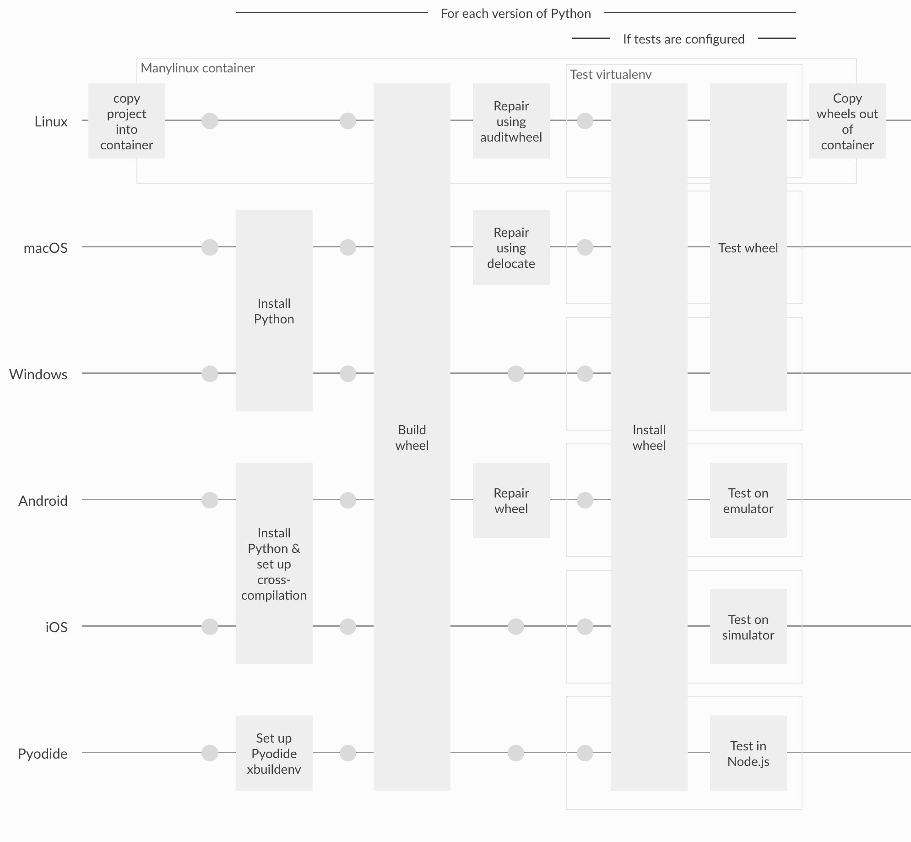

  

    <!-- BEHIND THE GRID CONTENT -->
    <!-- line for each platform -->
    

    

    

    <!-- the docker container outline -->
    

      

        Manylinux container
      

    

    <!-- the venv outlines -->
    

      
Test virtualenv

    

    

    

    <!-- THE GRID CONTENT -->
    <!-- the row labels -->
    
Linux

    
macOS

    
Windows

    <!-- the column labels -->
    

      
For each version of Python

    

    

      
If tests are configured

    

    <!-- the steps -->
    

      <component v-for="action in step"
                 class="action"
                 v-bind:is="action.href ? 'a' : 'div'"
                 v-bind:href="action.href">
        

          

            

          

        

        

          

            {{action.label}}
          

        

      </a>
    

  

<noscript>
  
  
<strong>Enable JavaScript for an interactive version of this diagram.</strong>

</noscript>

